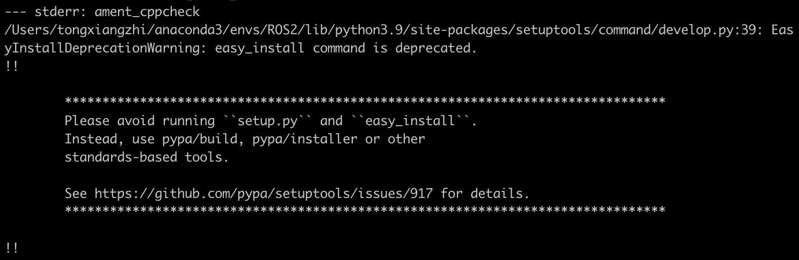

# ROS2

macOS上直接使用ros不是一个比较好的选择，切换为docker + vscode

## Bugs

### 1. 使用colcon build项目的时候

[原因] 因为setuptools的版本过高

[解决办法] https://answers.ros.org/question/396439/setuptoolsdeprecationwarning-setuppy-install-is-deprecated-use-build-and-pip-and-other-standards-based-tools/

